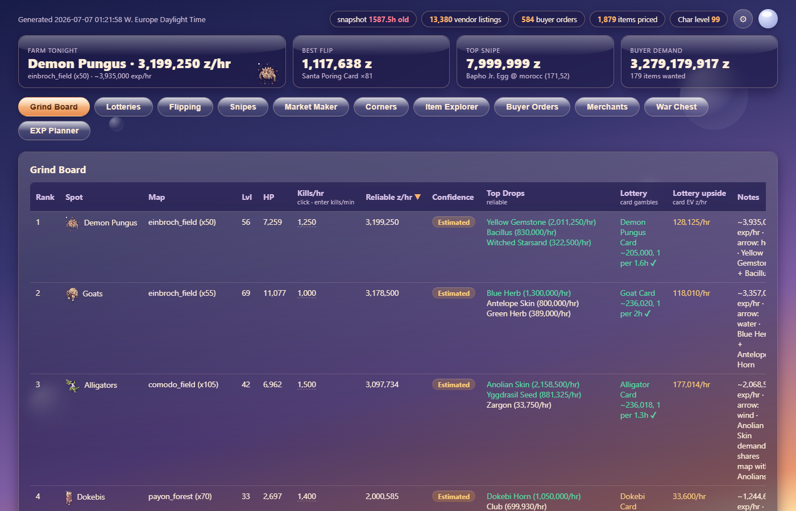

# Ragnarok Online Economy Command Center

Market intelligence for a Ragnarok Online private server. A local collector scrapes the live player market every day, cross-references it with the server's drop tables, quest data, and monster stats in Postgres, and renders a self-contained dashboard that answers one question: **where is the zeny tonight?**

[](https://github.com/314159DD/ro-economy-command-center/actions/workflows/test.yml)
[](LICENSE)




---

## What it produces

A single offline HTML file (icons and sprites embedded) with eleven tabs:

| Tab | Question it answers |
|---|---|
| Grind Board | Which farm spot pays the most per hour, counting only drops that provably sell |
| Lotteries | Which low-odds, high-value drops (cards, rare gear) are worth gambling on, and how many kills that takes |
| Flipping | Which listings can be bought and resold right now, to a standing buy order or to an NPC |
| Snipes | Which asks are far below the rest of the market, with seller depth as corroboration |
| Market Maker | Which items have the sales velocity and spread to compound capital by vending |
| Corners | Which demand-proven items have few enough sellers to buy out, within a capital budget |
| Item Explorer | Search any item: price history chart, realized sales, sell-through, best source |
| Buyer Orders | Aggregated standing demand per item, and hours-to-fill from the damage model |
| Merchants | Habitual undercutters across snapshot history |
| War Chest | Consumable prices leading into the weekly siege, with day-of-week analytics |
| EXP Planner | Turn-in quests and mob EXP per level bracket |

Plus an action digest ("today's top flips, snipes, corners, watchlist restocks"), a trade ledger with per-strategy P&L, and a progress bar toward a zeny goal.

## How it works

```
collect (daily, local Chrome)             refresh (monthly, headless)
  Playwright -> ~650 market pages           requests -> monster drop tables
  parse vendors + buyer orders              requests -> wiki turn-in quests
  immutable snapshot -> Postgres            RagnaAPI -> spawns, stats, EXP
  diff vs previous snapshot                       |
     -> probable_sales (demand signal)             |
            \                                      /
             +--------- scoring + report ---------+
                              |
                    market_report.html (offline, ~5 MB)
```

**Demand-aware valuation is the core design.** A vendor ask is not a price. Each drop is valued by the strongest evidence available:

1. A standing buyer order: use that guaranteed bid.
2. Three or more recorded sales (from snapshot diffs): realized median, discounted by liquidity.
3. Vendor-only with no sales history: ask times 0.1, flagged unproven.

So the grind board ranks by what provably sells, and a junk item sitting at a high ask with zero buyers cannot dominate the ranking. Low-odds drops are separated into a lottery column instead of being blended into expected value.

**Kills per hour** come from a damage model fitted to measured in-game numbers (effective attack, size modifier, target DEF, retarget time), giving an upper bound for every one of the 1,007 mobs on the server. Any cell can be overridden with an observed kills-per-minute, which persists in the browser.

**NPC sell prices are crawled from the server's own item pages**, not the mainline game data, because the server customizes them and the community wiki is incomplete. Mainline data is used only to fill gaps, never to overwrite.

## Why a browser and not a cron

The market pages past page one sit behind a Cloudflare managed challenge that only a real browser on a residential IP clears. Plain HTTP clients, TLS-impersonating clients, headless browsers, and every datacenter IP tested (VPS, GitHub Actions) get a 403 regardless of cookies. So the daily scrape runs locally with Playwright driving an installed Chrome under a persistent profile that keeps both the login session and the Cloudflare clearance warm. The reference-data refreshes are not gated and run headless anywhere.

## Setup

```
cd collector
python -m venv .venv && .venv\Scripts\pip install -r requirements.txt
.venv\Scripts\playwright install chromium
copy .env.example .env        # RO_CP_URL, RO_WIKI_URL, RO_SESSION_COOKIE, DATABASE_URL
.venv\Scripts\python scripts/init_db.py
.venv\Scripts\python scripts/load_seeds.py
..\refresh.bat                # monsters, quests, RagnaAPI (20-40 min, once)
..\collect.bat                # first market scrape + dashboard (15-20 min)
```

`RO_CP_URL` and `RO_WIKI_URL` point at the server's FluxCP control panel and wiki; the code carries no server name. `RO_SESSION_COOKIE` is the control-panel session cookie taken from DevTools after logging in (the login form has a reCAPTCHA, so there is no scripted login). `DATABASE_URL` is a Postgres connection string; Neon's free tier is enough.

Day to day, the batch files at the repo root are the interface:

| Command | Purpose |
|---|---|
| `collect.bat` | Scrape the market, store a snapshot, rebuild and open the dashboard |
| `report.bat` | Rebuild the dashboard from the current database, no scrape |
| `refresh.bat` | Re-crawl drop tables, quests, and monster stats |
| `log_session.bat --spot X --minutes 60 --kills 1150` | Calibrate a spot's kills per hour from a real run |
| `log_trade.bat --buy\|--sell <item> --qty N --price P --strategy flip\|snipe\|corner\|mm\|grind` | Feed the trade ledger |
| `log_balance.bat <zeny>` | Record a balance for the goal bar |

## Data model

`snapshots` (immutable, vendors or buyers) with `listings` and `buy_orders`; `probable_sales` from snapshot diffs; `monsters` and `drops` with server-true rates; `items` with crawled NPC prices and client descriptions; `farm_spots` and `farm_sessions` for calibration; `quest_turnins`; `monster_meta` and `monster_spawns` from RagnaAPI; `trades` and `balances` for the ledger. Schema in `collector/schema.sql`, idempotent so it can be re-run after adding columns.

## Tests

```
cd collector && .venv\Scripts\pytest
```

131 tests over the parsers (against captured HTML fixtures), the diff engine, the scoring and damage model, and the report builder. One database round-trip test runs only when `TEST_DATABASE_URL` is set.

## Project structure

```
collector/
  ro_collector/
    playwright_client.py   Real-Chrome transport with persistent profile and session detection
    http_client.py         requests transport for the non-gated sources
    parse_*.py             One parser per source: merchant, monster, wiki, item, itemdb, RagnaAPI
    run_daily.py           Scrape, snapshot, diff
    run_refresh.py         Reference-data refresh
    enrich_*.py            Item stats, NPC prices, client descriptions, RagnaAPI
    diff.py                Snapshot diff -> probable sales
    scoring.py             Valuation, damage model, flips, snipes, corners, market maker
    shortlist.py           Text grind board
    report.py              HTML dashboard generator
    db.py, models.py       Postgres store and row types
  scripts/                 init_db, load_seeds, capture_fixtures
  tests/                   131 tests, HTML fixtures
  schema.sql
seeds/                     Curated farm spots, drop overrides, war supplies, siege schedule
docs/design/               Design specs for the pipeline, the expansion, and the dashboard theme
*.bat                      The six commands above
```

## License

MIT. See [LICENSE](LICENSE).
